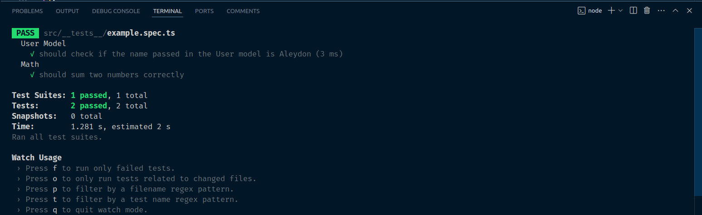

<h2 align='center'>:earth_americas: NodeJs Template :earth_americas:</h2>

## :pushpin: Requirements: :pushpin:

NodeJs: :link: https://nodejs.org/en/

---

#### :arrow_forward: Get Started:

1. Clone this repo

```sh
git clone https://github.com/Aleydon/NodeJs-Template.git
```

2. Install NPM packages

```sh
npm install or yarn install
```

3.  Run this project

```sh
npm run dev or yarn dev
```

---

<h2>Template configuration:</h2>

- Jest for automated testing. :link: https://jestjs.io/
- Eslint + Prettier for code standardization and formatting. :link: https://eslint.org/ + https://prettier.io/
- Typescript for typing. :link: https://www.typescriptlang.org/
- HuskyJs for automatically lint your commit messages, code, and run tests upon committing or pushing. :link: https://typicode.github.io/husky/

---

<h2>Relative Paths Config:</h2>

```sh
	"baseUrl": "./",
		"paths": {
			"@controllers/*": ["./src/controllers/*"],
			"@models/*": ["./src/models/*"],
			"@routes/*": ["./src/routes/*"],
			"@services/*": ["./src/services/*"],
			"@utils/*": ["./src/utils/*"],
			"@constants/*": ["./src/constants/*"],
			"@config/*": ["./src/config/*"]
		},
```

<h2>Tests:</h2>

- How to run tests:

```sh
npm run test or npm run test:watch
```

It has an example of tests with Jest + Testing-Library in _src/**tests**/example.spec.tsx_

```ts
import { UserModel } from '@models/user.model';

const sum = (numberA: number, numberB: number) => {
	return numberA + numberB;
};

describe('User Model', () => {
	it('should check if the name passed in the User model is Aleydon', () => {
		const user = new UserModel('Aleydon', 29);
		expect(user.name).toBe('Aleydon');
	});
});

describe('Math', () => {
	it('should sum two numbers correctly', () => {
		const result = sum(1, 2);
		expect(result).toBe(3);
	});
});
```

<h2>Test Running:</h2>
<p align="center">
  <br>
  
  <br>
  <br>
</p>
